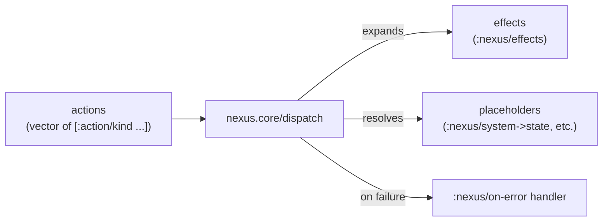

# Architecture

## `nexus.core` — the dispatch engine

`nexus.core` is toolkit-agnostic by design, exactly like upstream
[nexus](https://github.com/cjohansen/nexus): it knows nothing about any
particular rendering library or event shape. Dispatch works over plain
data:

An **action** is a vector whose first element is a keyword —
`[:action/kind arg1 arg2 ...]`. `nexus.core/action?`/`actions?` are the
predicates that recognize this shape. Dispatching a sequence of actions
expands each one against a registered handler, which produces
**effects** — data describing a side effect to perform, resolved
against the effect handlers registered for that effect's keyword.
**Placeholders** let an action reference values from the current system
state without the caller having to thread that state through by hand.

Errors during dispatch route through the registry's `:nexus/on-error`
handler if one is set, rather than throwing uncaught — the handler
itself is wrapped in its own `try`/`catch` too, so a broken error
handler can't take down dispatch.

## `nexus.registry` — the convenience layer

`nexus.core` alone expects a config map (system→state fn,
system+dispatch-data→state fn, an effects map, a placeholders map, an
interceptors vector, an on-error fn) threaded through every `dispatch`
call. `nexus.registry` wraps that in a single atom (`!registry`) with
register-once functions:

- `register-system->state!`, `register-system+dispatch-data->state!` —
  the two ways placeholders resolve state.
- `register-action!` / `register-expansion!` — same thing, two names
  (both register an action-keyword → handler-fn mapping).
- `register-effect!` — register an effect-keyword → handler-fn mapping.
- `register-placeholder!` — register a placeholder-keyword → handler-fn
  mapping.
- `register-interceptor!` — add a dispatch interceptor (single-phase or
  multi-phase map form).
- `on-error` — set the error handler.
- `dispatch` — call `nexus.core/dispatch` against the accumulated
  registry, so call sites just pass `system`, `dispatch-data`, and
  `actions`, never the whole config map.

Most consumers use `nexus.registry`, not `nexus.core` directly, for
exactly this reason: register handlers once at startup, then dispatch
without re-threading configuration through every call site.

## Only adaptation from upstream

`nexus.core`'s three `#?(:clj Exception :cljs :default)`
reader-conditionals collapse to a plain `Exception` catch — this port
targets Jolt only, there's no ClojureScript target to conditionalize
for. `nexus.registry` needed no adaptation at all: pure atom and map
operations, no reader conditionals in the source to begin with.

See [Contributing](contributing.md) for the provenance rules governing
changes to ported code, and this repo's `NOTICE` file for the complete
record of what came from where.
